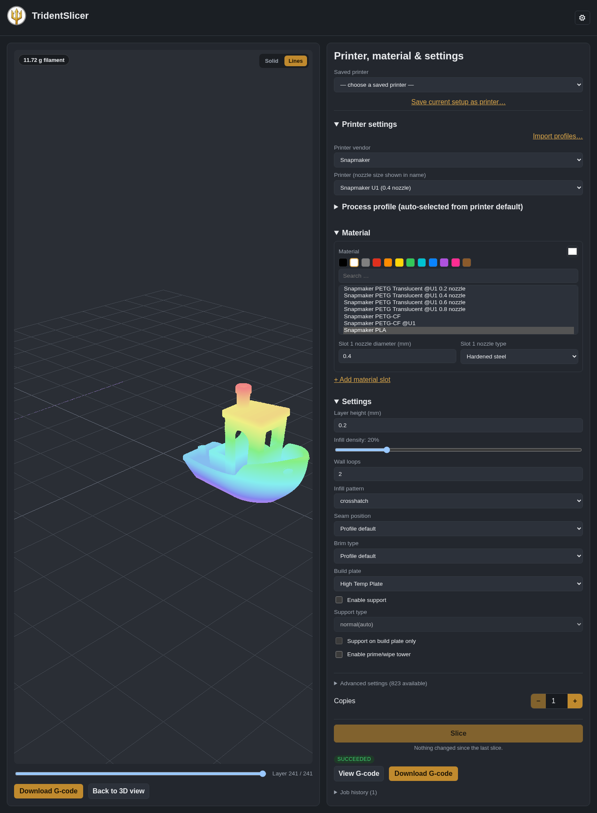
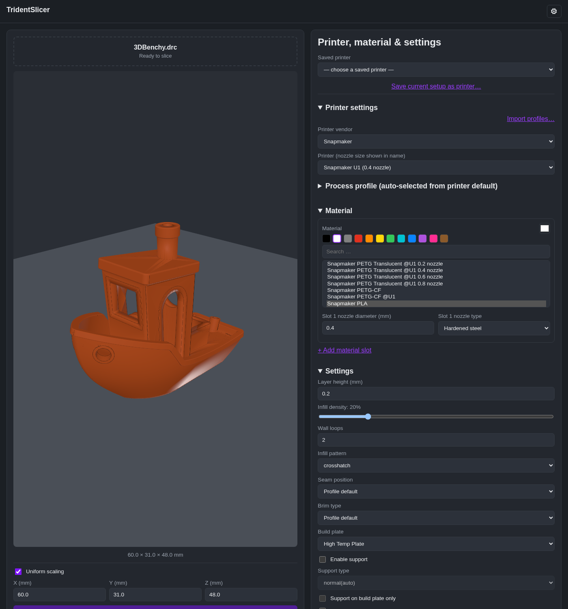
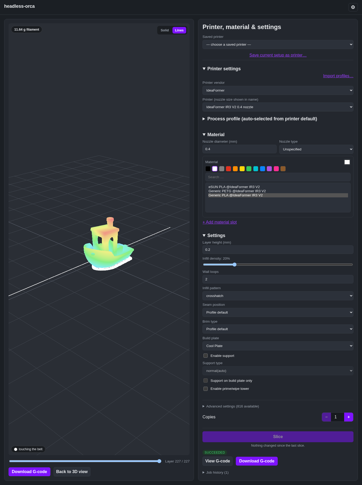

<p align="center">
  
</p>

<h1 align="center">TridentSlicer</h1>

<p align="center">
  <b>A self-hosted slicer for your server.</b><br>
  OrcaSlicer's slicing engine, run headless in Docker, with a web UI you can use from any browser or phone.
  Works with the printers OrcaSlicer supports, and with belt printers as a bonus.

<p align="center">
  <a href="https://ko-fi.com/mugenoesis"></a>
</p>

</p>
<p align="center">
https://www.youtube.com/watch?v=1vSq-iEaazE
</p>

<p align="center">
  
</p>

## What it does

Upload a model, pick a printer and material, slice, preview the G-code layer by layer, and download it or send it
straight to your printer. It runs on a NAS or home server, so you can slice from your phone, or from a
machine that has no slicer installed.

- **Your printer is probably already in it.** OrcaSlicer's whole printer, filament and process library is built in,
  from 70+ vendors (Bambu Lab, Prusa, Creality, Snapmaker, Voron, Elegoo, Anycubic, Qidi, Sovol and many more). You can
  also import your own profiles (`.json`, `.zip`, `.orca_printer`, `.orca_filament`, `.orca_bundle`).
- **Make your own printers.** A printer that isn't in the list: copy one (or start from nothing, or a generic Marlin, Klipper, RRF, Repetier or belt printer) and set the bed, nozzle, firmware, start and end G-code and motion, with every other printer setting a search away on the Advanced tab. Belt printers can be endless or have a real length. You can export your printers and materials for desktop OrcaSlicer.
- **Make your own materials.** Create a new material from any existing one with a short form (temperatures, bed
  temperature per plate, flow, fan); everything else is inherited, and any other material setting is a search away on the Advanced tab, and you choose whether it is for the current printer only or for every printer.
- **Multi-material and tool changers.** Assign a file's colours to nozzles and slice multi-colour models, including
  4-head printers like the Snapmaker U1. The build plate list only offers plates your chosen filament supports.
- **Multi-plate 3MF files.** Preview each plate, slice any plate, and choose which objects in a file to print, with
  thumbnails so you can tell them apart.
- **Rotate and move.** A preview of your plate with sliders to place the model and to turn it on each axis, plus
  "Lay flat" and "Pick a face" (choose the face that should sit on the plate in a window of its own, and the plate is
  see-through so you can pick the underside). Works for 3MF files too. For a file with several objects, pick one and
  turn or move it while the others stay greyed out; Apply writes them all together, and overlaps are flagged. With a
  multi-plate file it works on the plate you have picked and leaves the other plates alone.
- **Scale, auto-orient, auto-arrange and copies.** Scale the model, let the slicer orient or arrange it, and print
  several copies.
- **Mesh check.** STL files are checked on upload for the defects the slicer repairs, and holes it cannot repair are
  flagged before they become a bad print.
- **Send to your printer.** Upload the G-code to a Moonraker (Klipper, Mainsail, Fluidd) or OctoPrint printer.
- **Every setting is reachable.** The common ones (layer height, infill, walls, seam, brim, supports, build plate) are
  up front, and all 800+ OrcaSlicer settings are under Advanced. Saved printers and settings profiles keep your setups.
- **Works on a phone.** Responsive single-page app, installable as a PWA. There is also an HTTP API with Swagger docs
  at `/docs`.
- **Single-user or multi-user.** Run it just for yourself with no login, or switch to accounts.

<p align="center">
  
</p>

### Bonus: belt printers

Belt (conveyor) printers such as the IdeaFormer IR3 V2 work too, which most slicers can't do well. Trident adds tree
supports that grow down to the belt, a flat pad at the belt, purge-line alignment so the print starts right at the
purge, and an endless-length bed. You can line several objects up along the belt and drag them into print order.

<p align="center">
  
</p>

## Install

Trident is one container. It needs port 8000 and three folders to keep your data.

### Docker

```bash
docker run -d --name trident --restart unless-stopped \
  -p 8000:8000 \
  -v /path/to/trident/models:/data/models \
  -v /path/to/trident/output:/data/output \
  -v /path/to/trident/orcaslicer-datadir:/data/orcaslicer-datadir \
  mugenoesis/trident:latest
```

Then open `http://<your-server>:8000/`. The first visit asks whether it's just you (no login) or several people.

> **Security:** in single-user mode there is no login, so anyone who can reach port 8000 can use Trident, see your models and use your saved printers. Keep it on your home network. Before exposing it to the internet, switch on multi-user mode (accounts) and put it behind an HTTPS reverse proxy.

### Docker Compose

```yaml
services:
  trident:
    image: mugenoesis/trident:latest
    container_name: trident
    restart: unless-stopped
    ports:
      - "8000:8000"
    volumes:
      - ./data/models:/data/models                    # uploaded models
      - ./data/output:/data/output                    # sliced G-code, jobs, saved printers and settings
      - ./data/orcaslicer-datadir:/data/orcaslicer-datadir
```

### Unraid

Open the **Apps** tab, search for "Trident" and click **Install**. The template maps port 8000 and stores everything
under `/mnt/user/appdata/trident/`. The template lives in
[mugenoesis/unraid-templates](https://github.com/mugenoesis/unraid-templates).

### Notes

- **Architecture:** the image is `linux/amd64` only.
- **Size:** about 1.4 GB on disk (about 560 MB to download).
- **Your data** lives only in the three mounted folders; the container itself keeps nothing.
- **Exposing it outside your network:** see the security note above (multi-user mode and an HTTPS reverse proxy).

## Build it yourself

```bash
git clone --recurse-submodules https://github.com/mugenoesis/Trident.git
cd Trident
docker build -f docker/Dockerfile -t trident \
  --build-arg ORCASLICER_COMMIT_SHA=$(git -C vendor/orcaslicer rev-parse HEAD) .
```

The first build compiles OrcaSlicer from source and takes a long time (about an hour on a fast machine). Pass
`--build-arg BUILD_JOBS=<n>` to limit how many cores it uses. Later builds reuse the cached layers.

## Developing

```bash
cd api
python3 -m venv .venv && .venv/bin/pip install -e ".[dev]"
.venv/bin/pytest                          # mocked, no OrcaSlicer binary needed
.venv/bin/uvicorn app.main:app --reload   # http://localhost:8000/docs
```

Without a real `orca-slicer` binary the slicing endpoints degrade gracefully, which is handy for working on the API.
The web app lives in [`web/`](web/README.md). The design is in [`docs/ARCHITECTURE.md`](docs/ARCHITECTURE.md).

```
Trident/
├── vendor/orcaslicer/   # git submodule: the patched OrcaSlicer fork
├── docker/              # multi-stage Dockerfile and entrypoint
├── api/                 # FastAPI service
├── web/                 # React/Vite web app
├── docs/                # architecture and AGPL notes
└── scripts/             # smoke tests and helpers
```

## Support the project

Trident is free and I build it in my spare time. If it saves you time or gets your printer printing, you can
[buy me a coffee on Ko-fi](https://ko-fi.com/mugenoesis). Bug reports and ideas are welcome as GitHub issues.

## License and credits

Trident is licensed under the [GNU Affero General Public License v3.0](LICENSE). Copyright (C) 2026 mugenoesis.

It is built on [OrcaSlicer](https://github.com/OrcaSlicer/OrcaSlicer) (AGPL-3.0), which descends from Bambu
Studio, PrusaSlicer and Slic3r. This project is not affiliated with or endorsed by any of them. The slicer inside the
container is a patched fork (see `vendor/orcaslicer`, a git submodule). If you use a hosted instance over a network,
you are entitled to the corresponding source:

- Pseudorca, the patched OrcaSlicer fork: <https://github.com/mugenoesis/Pseudorca/tree/headless-orca>
- This repository: <https://github.com/mugenoesis/Trident>

The exact commit the running container was built from is shown by the app's `/source` and `/version` endpoints.
See [`docs/AGPL-COMPLIANCE.md`](docs/AGPL-COMPLIANCE.md).
